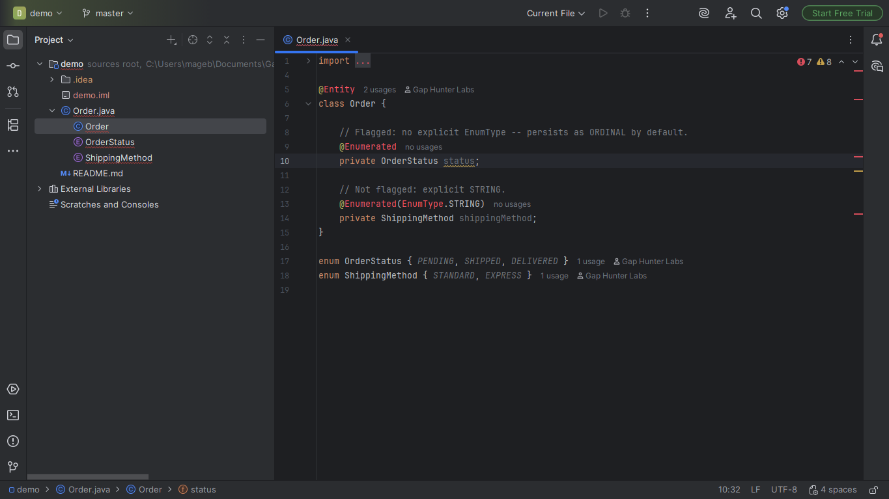
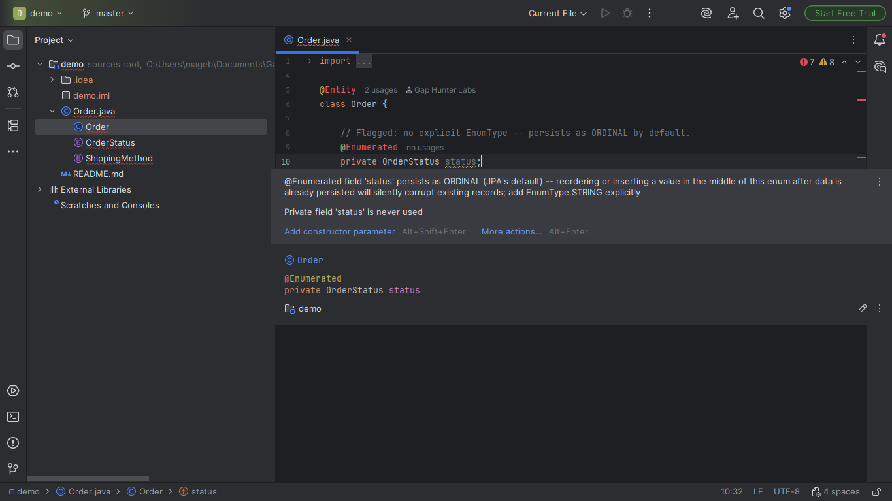

# Enum-Ordinal Persistence Companion

Warning on a JPA `@Enumerated` field with no explicit
`EnumType.STRING`, on a real `@Entity` class -- JPA's own default is
`ORDINAL`.

## Screenshots





## Why it exists

Reordering or inserting a value in the middle of the enum after data
has already been persisted silently corrupts existing records (the
stored ordinal no longer corresponds to the same constant) -- a
well-documented fragility (Baeldung and official JPA persistence
guides). No Marketplace plugin found that flags it, despite several
enum-tooling plugins existing.

## Why built this way

Confirms the field genuinely reaches persistent storage (the
containing class is a real JPA `@Entity`), not just checking the
annotation in isolation -- a `@Enumerated` field on a plain DTO/POJO
with no `@Entity` is never flagged, since it never actually persists
anywhere.

## v0.1 scope — stated honestly, not exhaustively

Only standard JPA `@Enumerated` on an `@Entity` class -- doesn't cover
custom serialization (Jackson `@JsonValue`, protobuf enum) or non-JPA
persistence frameworks.

## Usage

Open any Java file with a JPA `@Entity` class. A `@Enumerated` field
with no explicit `EnumType.STRING` shows a warning.

## Enterprise / Team Licensing

Need enterprise features, custom rules, or team licensing? Contact us at
**gaphunterlabs@gmail.com**.

## Development

```
./gradlew test           # unit tests
./gradlew buildPlugin    # generates build/distributions/*.zip
./gradlew verifyPlugin   # checks compatibility against real IDEs
```

## License

Apache-2.0. See `LICENSE`.
